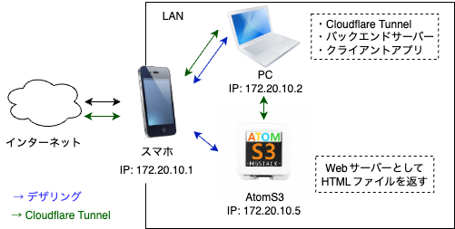
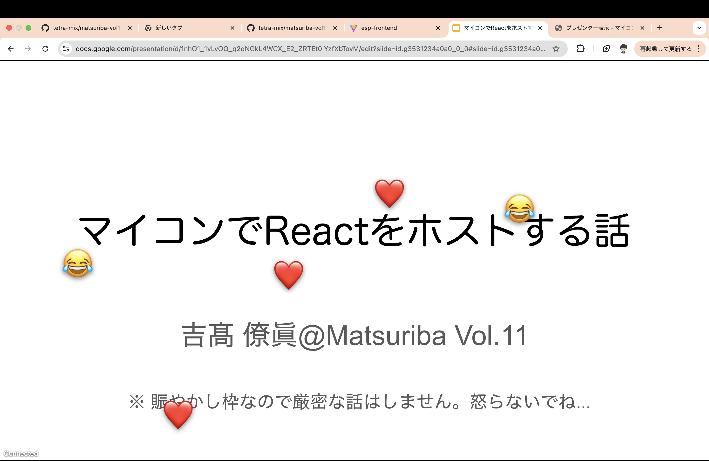

### 発表者用
以下を実行していることを確認

Cloudflare Tunnelの起動
```
cloudflared tunnel run mackbook
```

バックエンドサーバーの起動
```
cd matsuriba-backend
pnpm start
```


# Matsuriba Vol.11 LT
## マイコンでReactをホストする話

**ネットワーク図**


* スマホデザリングでLANを作ってインターネット接続
* Cloudflare Tunnelを使ってインターネットからアクセスができるように

**作ったもの**
* フロントエンド
* ハードウェア側でホストするプログラム
* バックエンドサーバー
* Chrome拡張機能

## プレゼンの画面


## 発表資料
[Googleスライド マイコンでReactをホストする話 @Matsuriba Vol.11](https://docs.google.com/presentation/d/1nhO1_1yLvOO_q2qNGkL4WCX_E2_ZRTEt0IYzfXbToyM/edit?usp=sharing
)